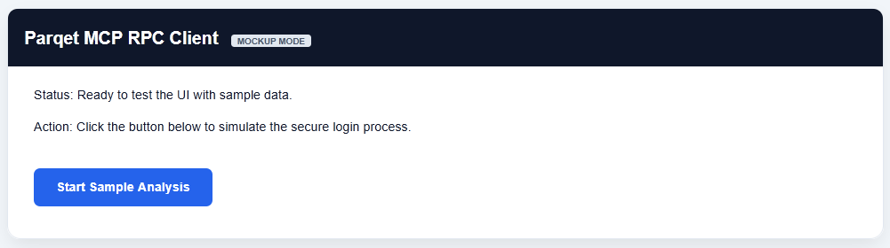
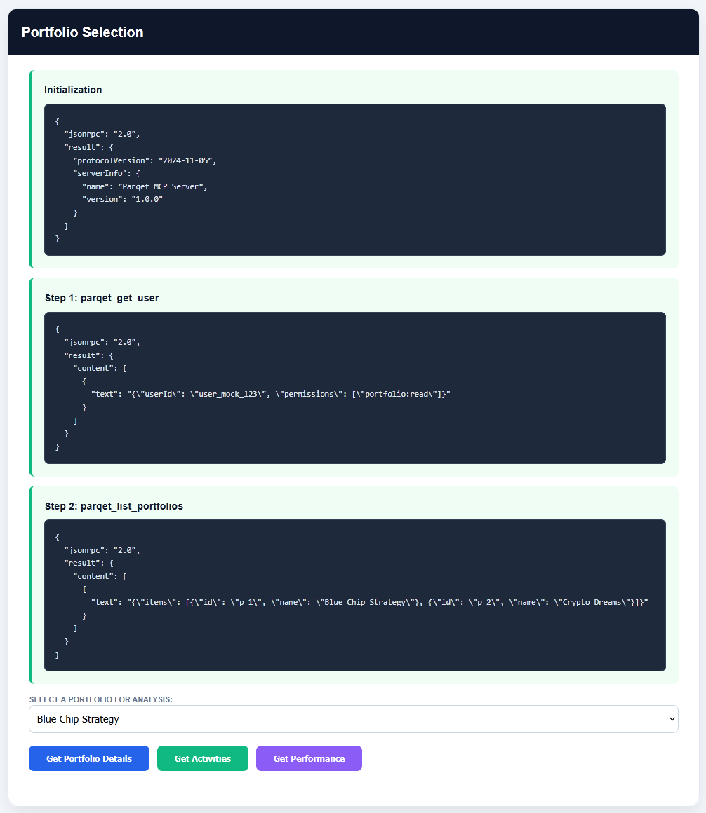
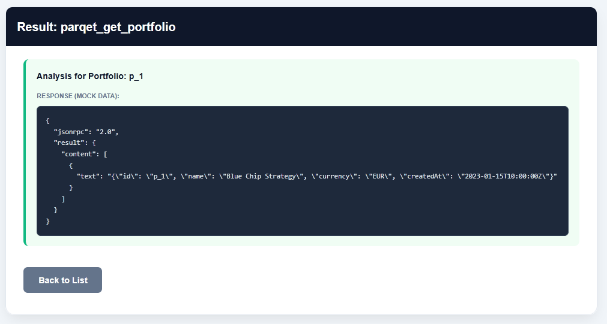
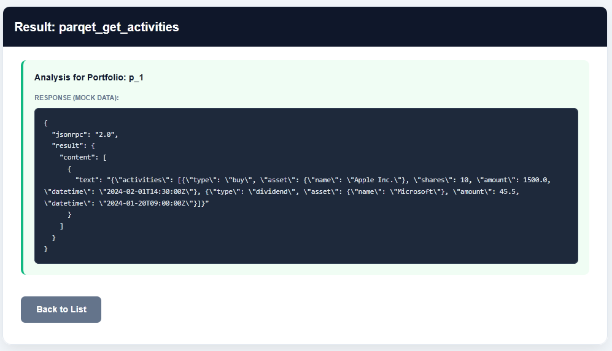
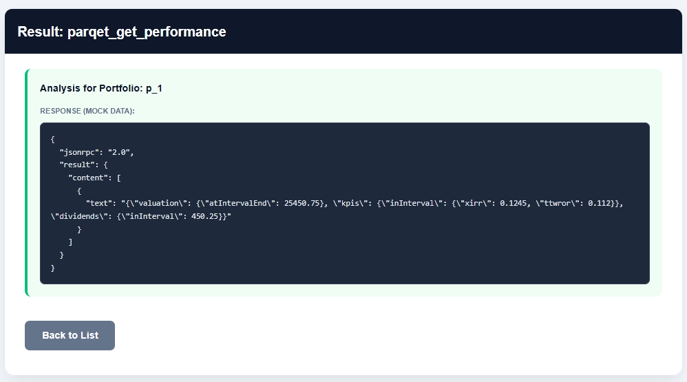

# **Parqet Connect MCP \- Python Test Client**

This repository contains a lightweight Python-based test client for the **Parqet Connect MCP API**. It demonstrates how to implement a secure **OAuth2 flow with PKCE (S256)** and interact with the Parqet MCP JSON-RPC endpoint.

## 📸 Screenshots
*(Note: These screenshots were generated using the provided mockup tool to protect private financial data.)*

| Start Page | Portfolio Selection |
| :--- | :--- |
|  |  |

| Portfolio Details | Activities | Performance |
| :--- | :--- | :--- |
|  |  |  |

## **🚀 Key Features**

* **Secure Authentication**: Full implementation of OAuth2 with PKCE (Proof Key for Code Exchange).  
* **JSON-RPC Integration**: Direct communication with the /mcp endpoint using JSON-RPC 2.0.  
* **Portfolio Discovery**: Automatically lists all available portfolios after a successful login.  
* **Analysis Tools**:  
  * **Portfolio Details**: Basic information and currency settings.  
  * **Performance Data**: Fetches KPIs like XIRR, TTWROR, and absolute gain.  
  * **Activities**: Displays recent transactions (Buy, Sell, Dividends, etc.).  
* **Privacy First**: Includes a dedicated app\_mockup.py for demonstration purposes and safe screenshot generation.

## **🛠 Project Structure**

* app.py: The main application template (Insert your Client ID here).  
* app\_mockup.py: A standalone version with fake data for safe presentations and screenshots.  
* requirements.txt: Required dependencies (Flask & Requests).  
* .gitignore: Configured to keep local credentials, the PKCE verifier, and private testing scripts out of the repository.

## **📦 Installation & Setup**

1. **Prerequisites**:  
   * **Python 3.x** must be installed on your system.  
2. **Virtual Environment (Setup & Activation)**:  
   To keep your global Python installation clean, create and activate a virtual environment. **This step is required before installing dependencies.**  
   \# 1\. Create the environment  
   python \-m venv venv

   \# 2\. Activate the environment (Windows)  
   .\\venv\\Scripts\\activate

   *After activation, your terminal prompt should show (venv) at the beginning.*  
3. **Install Dependencies**:  
   Once the environment is active, install the required packages:  
   pip install \-r requirements.txt

4. **Configuration**:  
   * Open app.py and insert your **Client ID** into the CLIENT\_ID variable.  
5. **Parqet Console Settings**:  
   * Register your integration at the [Parqet Console](https://www.google.com/search?q=https://console.parqet.com).  
   * Set the Redirect URI to http://localhost:3000/callback.

## **🚦 Usage**

### **Run the Client**

python app.py

### **Run the Mockup (Safe for Demo)**

To see the UI and explore the features without connecting to a real account:  
python app\_mockup.py

## **🔒 Security Notes**

* The **PKCE Verifier** is generated and stored locally in verifier.txt during the login process.  
* This file is strictly excluded via .gitignore to prevent session data or security tokens from being uploaded to GitHub.  
* For production use, ensure your Client ID and secrets are handled securely (e.g., via environment variables).

## **📖 Background & API Reference**

This project is based on the official Parqet documentation. To use the API, follow these steps in the [Parqet Developer Portal](https://developer.parqet.com):

1. **Organization & Integration**: Create an organization and an integration in the Parqet Console.  
2. **Client ID**: Copy your unique Client ID and paste it into the app.py file.  
3. **Redirect URI**: Ensure http://localhost:3000/callback is added as an authorized redirect URL in your integration settings.  
4. **Specifications & Documentation**:  
   * [OpenAPI Specification (JSON)](https://developer.parqet.com/api-spec/current.json)  
   * [Developer Hub Overview (llms.txt)](https://developer.parqet.com/llms.txt)  
   * [Available Tools & Schema](https://developer.parqet.com/docs/give-ai-portfolio-context-with-the-parqet-mcp#available-tools)

*Disclaimer: This is an independent open-source project and not an official product of Parqet GmbH.*
